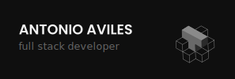

## Hi, I'm Tony 👋

I am an industrial engineer and full stack developer passionate about collaborating and making learning more accessible, creating technology that supports and helps the community.Some technologies that I enjoy working with are ReactJS, PERN stack and I keep learning more languages. In 2022 I started my career change with larnU startup 👽, my interest led me to participate in the first Ucamp.io hackathon where we were one of the 6 finalist projects.

## About me 🌎:
- Industrial engineer and computer systems technician from UTEL 💻︎✍🏾
- Community member of the larnU startup from Santiago Chile. 👽
- Currently studying at camp.io UX/UI bootcamp and Launch X LATAM challenge

--- 

## coding 💻:

 

